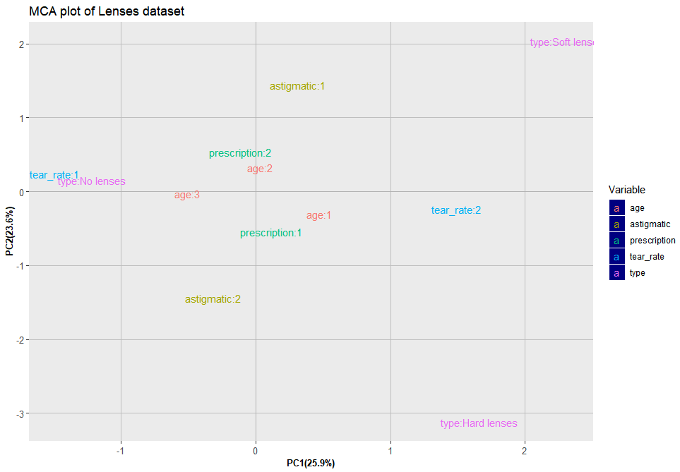

# LensesPrescription
The current project consists of analysing a multivariate Lenses dataset (https://archive.ics.uci.edu/ml/datasets/lenses). It contains several classes of lenses receipts for the patients based on their characteristics. We aim to consider the data from two different points of view. First, we want to estimate the possibility to separate the data in order to be able to predict the receipt automatically. Second, we are interested in the inner relations within the dataset, whether the patients’ attributes associate to each other and how. The dataset is of a personal interest, due to the fact that I have been using lenses for several years already. 

But first, the libraries we used in the current example are:
```
library(ggplot2)
library(scales)
library(gridExtra)
library(MASS)
library(ca)
```

## Description of the dataset
The data considered are complete and noise free. Also, they highly simplified the problem since the attributes do not fully describe all the factors affecting the decision as to which type, if any, to fit. The purpose of such data to analyze is to test different multivariate techniques without spending time on data preprocessing.

So, the chosen dataset contains five categorical variables:
1)  Possible classes of recommendation to a patient: 
- ’1’: the patient should be fitted with hard contact lenses, 
- ’2’: the patient should be fitted with soft contact lenses, 
- ’3’: the patient should not be fitted with contact lenses. 
2) Age of the patient: 
- ’1’: young, 
- ’2’: pre-presbyopic, 
- ’3’: presbyopic. 
3) Spectacle prescription: 
- ’1’: myope, 
- ’2’: hypermetrope. 
4) Astigmatic: 
- ’1’: no, 
- ’2’: yes. 
5) Tear production rate: 
- ’1’: reduced, 
- ’2’: normal.

To visualize the data we build a set of piecharts presenting the distribution of different modalities of each variable.
```
columnNames<-c("Age of the patient","Spectacle prescription","Astigmatic","Tear production rate","Type of lense fit")
colors <- c("yellow","red","deeppink3","green2","yellow","pink","green4")
numberOfColumns = dim(data)[2] 

#draw piecharts in a loop
for (i in 1:numberOfColumns){
  #work with data
  currentColumn <- table(data[,i])
  percentages <- round(100*currentColumn/sum(currentColumn),0)
  #work with appearance
  pieLabels<- paste(percentages,"%",sep="")
  selectedColors <- colors[1:length(tmp)]
  ##main title of a piechart
  title <- columnNames[i] 
  ##names in a legend
  legend("topleft",names(percentages),fill=cols,cex=0.8)
  #do the plotting
  pie(currentColumn,main=title,col = selectedColors, labels = pieLabels,cex = 0.8)
}
```
From the gerenated picture below we might conclude that nearly all the variables have same proportion of modalities except ’Possible classes of recommendation’. More than a half of patients should not be fitted with lenses, while the amount of ’hard-lenses’ and ’soft-lenses’ recommendations is nearly the same.

<p align="center">
  
</p>

As was mentioned before we want to analyse the data from two different points of view. Taking into account the type of its variables, we might conclude that it might be analysed with the following methods:

1) <b>Linear discriminant analysis.</b> We might consider the task of predicting the recommendation for a patient based on his or her medical attributes. 
2) <b>Multiple correspondence analysis.</b> We also may try to determine ’within-dataset’ relations, which might explain the dataset from another point of view.

## Linear discriminant analysis
The aim of discriminant analysis is to find a way to separate two or more classes of objects or events. That is then used in classfication of new observations. In the current dataset, we have three groups of data divided by ’Recommendation’ attribute. After performing LDA (Linear Discriminant Analysis) we can use singular values to compute the amount of the between-group variance that is explained by each linear discriminant. Here's the summary given by running LDA analysis:
<p align="center">
  
</p>
In our example, we see that the first linear discriminant explains 59,3% and the second 40,7% of the between-group variance, which basically means that they are nearly of the same importance. A graph below presents the current dataset in LD components.


### Giving prescription
In order to check the estimator I plugged in medical attributes about myself in order to test whether I use right type lenses or not. So the new object had the following properties: young (age), myope (spectacle prescription), yes (astigmatic), normal (tear production rate). 
```
newObject <- matrix(c(1,1,2,2),nrow=1)
dimnames(newObject) <- list(NULL, c("age","prescription","astigmatic","tear_rate"))
newObject <- data.frame(newObject)
predict(lda, newdata=newObject)
```
The results were illustrative enough: <b>with probability 98% I should use hard lenses</b>. The probabilities of belonging to other groups are 0.3% for ’No lenses’ and 2% for ’Soft lenses’.

```
$posterior
  Hard lenses   No lenses Soft lenses
1    0.977172 0.003286019    0.019542
```


## Multiple correspondence analysis
Multiple correspondence analysis is used to categorical datasets which means that this type of analysis is acceptable in our case. The aim of the MCA is to produce graphical display in lower dimension which reproduce, without losing too much information, the associations between the modalities through the attraction repulsion index.

After performing calculations of the MCA we analyze the graph below. We have two principal components here (although they describe only 49,4% of variance).

<p align="center">
  
</p>

Two individuals are close if they have in general the same modalities and looking at the graph we should compare the angles between points to detect whether they are attracted to each other or not. From the picture above we might notice some obvious trends:

* People with presbyopic age and reduced tear rate production are usually advised not to wear lenses at all. 
* People with young or pre-presbyopic age, normal tear production rate and not having astigmatism are mostly advised to wear soft lenses. 
* Young people with normal tear production rate having astigmatism and myope advised to wear hard lenses.

## Conclusion
In the current toy project we dealt with fully categorical multivariate dataset related to medicine, more precisely to lenses. First, we wanted to identify a pattern for predicting lenses receipts for patients using Linear Discriminant Analysis. The analysis was performed and the predictor was tested on one specific patient and the result was plausible as we had known the receipt beforehand. Secondarily, we considered within dataset properties by Multiple Correspondence Analysis and derived conclusions illustrated the relations quite fully. The observed associations were natural (like presbyopic people with reduced tear rate should not wear lenses) and explained the dataset from the inner point of view. Overall, we sucessfully tested two multivariate data analysis techniques and furthermore, the conducted research showed interesting and expected patterns of the Lenses dataset.

